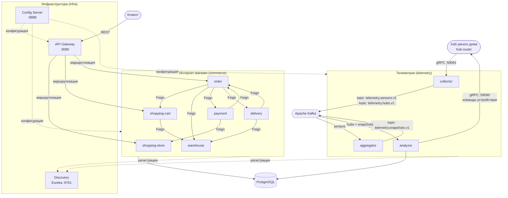
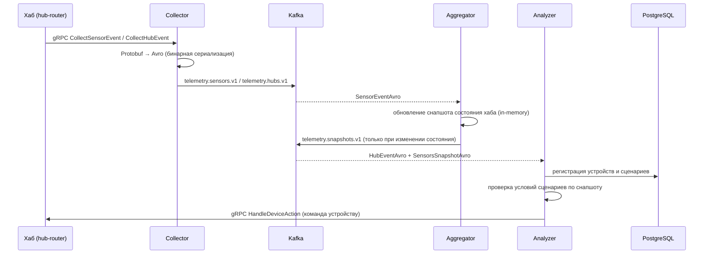
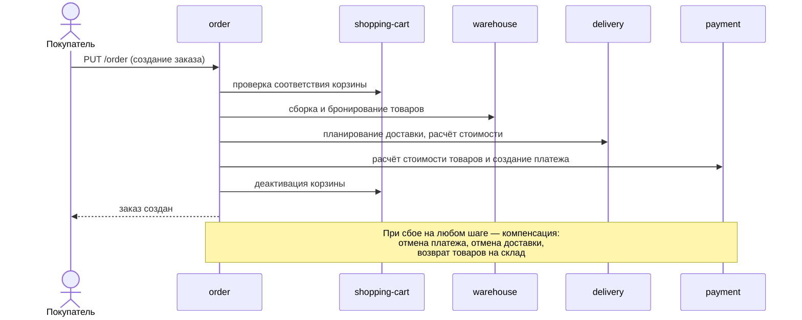

# Smart Home Technologies — микросервисная платформа умного дома


Учебный проект, демонстрирующий проектирование и реализацию распределённой системы на Spring Boot / Spring Cloud: потоковая обработка телеметрии IoT-устройств (gRPC → Kafka → Avro) и интернет-магазин умных устройств с сага-оркестрацией заказов.

## О проекте

Платформа объединяет два предметных домена:

- **Телеметрия** — конвейер потоковой обработки событий умного дома: приём показаний датчиков и событий хаба по gRPC, агрегация состояния в снапшоты через Kafka и автоматическое выполнение пользовательских сценариев («если температура выше 25° — включить кондиционер»).
- **Коммерция** — интернет-магазин устройств умного дома: каталог, корзина, склад, заказ, оплата и доставка. Жизненный цикл заказа управляется сага-оркестратором с ручной компенсацией при сбоях.

Оба домена опираются на общий инфраструктурный слой: централизованную конфигурацию, реестр служб и единую точку входа.

## Оглавление

- [Как устроена система](#как-устроена-система)
  - [Архитектура](#архитектура)
  - [Конвейер обработки телеметрии](#конвейер-обработки-телеметрии)
  - [Сага оформления заказа](#сага-оформления-заказа)
- [Описание микросервисов](#описание-микросервисов)
- [Структура репозитория](#структура-репозитория)
- [Используемые технологии и архитектурные решения](#используемые-технологии-и-архитектурные-решения)
- [Стек технологий](#стек-технологий)
- [Порты сервисов](#порты-сервисов)
- [Запуск](#запуск)
- [Тестирование](#тестирование)

## Как устроена система

### Архитектура



- Клиенты магазина обращаются к **API Gateway (8080)** — единой точке входа; Gateway маршрутизирует запросы к сервисам через **Eureka**.
- Commerce-сервисы общаются между собой синхронно через **Feign-клиенты** (балансировка по Eureka service-id).
- Хаб умного дома отправляет события датчиков в **Collector** по **gRPC**; тот конвертирует Protobuf в **Avro** и публикует в **Kafka**.
- **Aggregator** сворачивает поток событий датчиков в снапшот состояния хаба и публикует его только при фактическом изменении состояния.
- **Analyzer** потребляет события хаба и снапшоты, хранит сценарии в **PostgreSQL**, проверяет условия и отправляет команды устройствам по gRPC обратно в хаб.
- **Config Server** централизованно раздаёт конфигурации всех микросервисов (native-профиль, конфиги в classpath).

### Конвейер обработки телеметрии



gRPC API системы: `CollectorController.CollectSensorEvent / CollectHubEvent` (приём событий), `HubRouterController.HandleDeviceAction` (выполнение действий на устройствах).

### Сага оформления заказа



Дальнейший жизненный цикл заказа (оплата, сборка, доставка, завершение) управляется callback-вызовами: `payment` и `delivery` уведомляют `order` о смене статусов через Feign, а состояние заказа проходит машину из 13 состояний (`NEW → ON_PAYMENT → PAID → ON_ASSEMBLY → ASSEMBLED → ON_DELIVERY → DELIVERED → COMPLETED` плюс ветки сбоев и отмены).

## Описание микросервисов

### Телеметрия (telemetry). Конвейер потоковой обработки событий
- **collector** — gRPC-сервер (порт 59091): принимает события датчиков и хаба в формате Protobuf, конвертирует в Avro и публикует в Kafka.
- **aggregator** — потоковый consumer/producer на «чистом» kafka-clients: инкрементально сворачивает события датчиков в снапшоты состояния хабов, хранит состояние в памяти, публикует снапшот только при изменении.
- **analyzer** — consumer двух топиков: сохраняет устройства и сценарии в PostgreSQL (JPA), сопоставляет снапшоты с условиями сценариев и отправляет команды устройствам по gRPC. Работает в два независимых consumer-потока (`HubProcessor`, `SnapshotProcessor`).
- **serialization/avro-schemas** — Avro-схемы (`.avdl`), кодогенерация, собственные Kafka serde и константы топиков.
- **serialization/proto-schemas** — `.proto`-схемы сообщений и gRPC-сервисов, кодогенерация стабов.

### Интернет-магазин (commerce). REST API для клиентов
- **shopping-store** — каталог товаров: CRUD, постраничный поиск по категориям, управление статусом и остатками.
- **shopping-cart** — корзина покупателя: одна активная корзина на пользователя, добавление/удаление товаров с проверкой наличия на складе.
- **warehouse** — склад: остатки, габариты и вес товаров, бронирование под заказ, возвраты, адрес склада.
- **order** — оркестратор саги создания заказа и его жизненного цикла.
- **payment** — платежи: расчёт стоимости товаров (с НДС) и полной стоимости заказа, обработка успеха/отказа оплаты.
- **delivery** — доставка: планирование, расчёт стоимости по тарифам (хрупкость, вес, объём, адрес), статусы доставки.
- **interaction-api** — общая библиотека контрактов: API-интерфейсы, Feign-клиенты, DTO, енумы состояний, исключения и глобальный `@RestControllerAdvice`, подключаемый через Spring Boot автоконфигурацию.

### Инфраструктура (infra)
- **config-server** — Spring Cloud Config Server (native-профиль): централизованное хранилище конфигураций всех микросервисов.
- **discovery-server** — реестр служб (Eureka), динамическое обнаружение сервисов.
- **gateway** — API Gateway на Spring Cloud Gateway: единая точка входа, маршрутизация `/{service}/**` → `lb://{service}/api/v1/{service}`.

## Структура репозитория

```
plus-smart-home-tech/
├── telemetry/                 # Конвейер потоковой обработки телеметрии
│   ├── serialization/
│   │   ├── avro-schemas/      #   Avro-схемы (.avdl), кастомные serde, топики
│   │   └── proto-schemas/     #   Protobuf-схемы и gRPC-стабы
│   ├── collector/             #   приём событий по gRPC → Kafka
│   ├── aggregator/            #   агрегация событий в снапшоты состояния
│   └── analyzer/              #   сценарии, условия, команды устройствам
├── commerce/                  # Микросервисы интернет-магазина
│   ├── interaction-api/       #   контракты: API-интерфейсы, Feign-клиенты, DTO
│   ├── shopping-store/        #   каталог товаров
│   ├── shopping-cart/         #   корзина покупателя
│   ├── warehouse/             #   склад и бронирование
│   ├── order/                 #   оркестратор саги заказа
│   ├── payment/               #   платежи и расчёт стоимости
│   ├── delivery/              #   планирование и стоимость доставки
│   └── open-api/              #   эталонные OpenAPI-спецификации сервисов
├── infra/                     # Инфраструктурные сервисы
│   ├── config-server/         #   централизованные конфигурации (native)
│   ├── discovery-server/      #   реестр служб (Eureka)
│   └── gateway/               #   API Gateway
├── hub-router/                # Эмулятор хаба (gRPC-пир анализатора) + тестовые скрипты
├── .github/workflows/         # CI: API-тесты
└── compose.yaml               # Kafka (KRaft) и 7 баз PostgreSQL
```

## Используемые технологии и архитектурные решения

- **Микросервисная архитектура** — два независимых домена (телеметрия и коммерция) на общем инфраструктурном слое; сервисы без фиксированных портов, обнаружение через Eureka, доступ через Gateway.
- **Event-driven конвейер** — телеметрия построена на асинхронной передаче событий через Kafka с тремя версионированными топиками (`telemetry.sensors.v1`, `telemetry.hubs.v1`, `telemetry.snapshots.v1`).
- **Низкоуровневая работа с Kafka** — «чистый» `kafka-clients` без spring-kafka: собственные consumer-циклы, ручное управление оффсетами (`commitAsync` батчами + `commitSync` при остановке), корректное завершение через `WakeupException` и shutdown hook, идемпотентный producer с `acks=all`.
- **Бинарная сериализация Apache Avro** — схемы описаны на Avro IDL (`.avdl`), классы генерируются на этапе сборки; собственные serde без Schema Registry.
- **gRPC + Protobuf** — приём событий от хаба и отправка команд устройствам; контракты в `.proto`, кодогенерация стабов при сборке.
- **Инкрементальная агрегация** — снапшот состояния хаба пересчитывается точечно по каждому событию и публикуется только при фактическом изменении состояния.
- **Паттерн Saga (оркестрация)** — создание заказа как цепочка синхронных вызовов склада, доставки и платежей с ручной компенсацией при сбое: отмена платежа и доставки, возврат товаров на склад.
- **Контрактное взаимодействие через Feign** — `@RestController` сервиса и его `@FeignClient` реализуют один и тот же Java-интерфейс из `interaction-api`: соответствие контракта проверяется компилятором с обеих сторон.
- **Централизованная конфигурация** — Spring Cloud Config Server с повторными попытками подключения на старте (spring-retry с экспоненциальным backoff).
- **Целостность на уровне БД** — `ddl-auto: validate` + явные `schema.sql`: CHECK-ограничения, зеркалирующие енумы, частичные уникальные индексы (одна активная корзина на пользователя), plpgsql-триггеры (принадлежность сценария и датчиков одному хабу).
- **Java 21** — records в DTO, pattern matching для `switch` при разборе Avro-типов в анализаторе.
- **Маппинг и кодогенерация** — MapStruct для преобразования сущностей, Lombok.
- **Контейнеризация** — вся инфраструктура (Kafka в KRaft-режиме, по отдельной PostgreSQL на сервис) поднимается одним Docker Compose.

## Стек технологий

- **Язык и платформа:** Java 21, Spring Boot 3.3.2
- **Микросервисный фреймворк:** Spring Cloud 2023.0.3 (Gateway, Eureka, Config, OpenFeign)
- **Работа с данными:** Spring Data JPA (Hibernate), PostgreSQL 16
- **Потоковая обработка:** Apache Kafka 3.6 (kafka-clients), Apache Avro 1.11
- **Удалённые вызовы:** gRPC 1.63, Google Protobuf, grpc-spring-boot-starter (net.devh)
- **Валидация и маппинг:** Spring Validation, MapStruct 1.6
- **Устойчивость:** Spring Retry (подключение к Config Server), ретраи и идемпотентность Kafka-продюсеров
- **Мониторинг:** Spring Boot Actuator
- **Кодогенерация:** Lombok, avro-maven-plugin, protobuf-maven-plugin
- **Инфраструктура:** Docker Compose, GitHub Actions

## Порты сервисов

| Компонент | Порт | Примечание |
|-----------|------|------------|
| API Gateway | `8080` | единая точка входа для клиентов |
| Discovery Server (Eureka) | `8761` | реестр служб |
| Config Server | `8888` | централизованные конфигурации |
| Collector (gRPC) | `59091` | приём событий от хаба |
| hub-router (gRPC) | `59090` | эмулятор хаба, принимает команды от analyzer |
| Commerce- и telemetry-сервисы | динамические | `server.port: 0`, обнаружение через Eureka |
| Apache Kafka | `9092` | брокер сообщений (Docker) |
| PostgreSQL | `5432`–`5438` | по отдельной БД на сервис (Docker) |

Базы данных: `5432` analyzer, `5433` shopping-store, `5434` shopping-cart, `5435` warehouse, `5436` delivery, `5437` order, `5438` payment.

## Запуск

Поднимите инфраструктуру (Kafka с автосозданием топиков и все базы PostgreSQL со схемами):

```bash
docker compose up -d
```

Соберите проект:

```bash
mvn clean package
```

Запустите сервисы в следующем порядке:

```
1. discovery-server   — Eureka Service Discovery (:8761)
2. config-server      — Spring Cloud Config Server (:8888)
3. gateway            — API Gateway (:8080)
4. Commerce-сервисы   — shopping-store, shopping-cart, warehouse,
                        order, payment, delivery
5. Телеметрия         — collector, aggregator, analyzer
```

Для проверки телеметрии дополнительно запустите эмулятор хаба (принимает команды устройствам от анализатора):

```bash
java -jar hub-router/scripts/hub-router.jar
```

После запуска REST API магазина доступен через Gateway: `http://localhost:8080/{service}/...` (например, `GET http://localhost:8080/shopping-store?category=SENSORS`), реестр сервисов — на `http://localhost:8761`.

## Тестирование

- **Сценарные тесты телеметрии** — скрипты в `hub-router/scripts/` (варианты для Windows и macOS/Linux): проверка collector (JSON и gRPC), aggregator и analyzer на полном конвейере с эмулятором хаба (`run-tests.bat` / `run-tests.sh`).
- **API-тесты коммерции** — CI-пайплайн GitHub Actions (`.github/workflows/api-tests.yml`) прогоняет тесты по эталонным OpenAPI-спецификациям из `commerce/open-api/` на каждый pull request.
